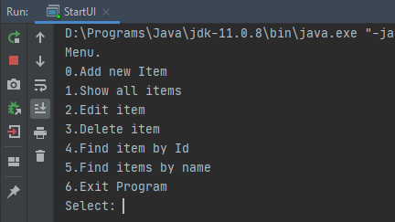

# job4j_tracker

## Описание
Учебный проект. Импровиированное хранилище заявок. Реализовано:
- ввод заявки (Add new Item)
- вывод всех заявок (Show all items)
- редактирование заявки (Edit item)
- удаление заявки (Delete item)
- поиск заявки по id (Find item by id)
- поиск заявки по имени (Find item by name)
- выход из программы (Exit program)

